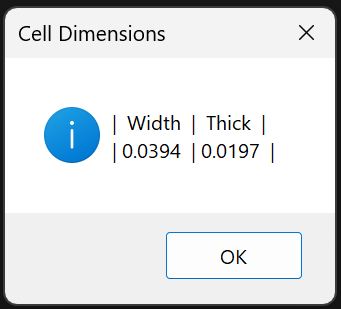
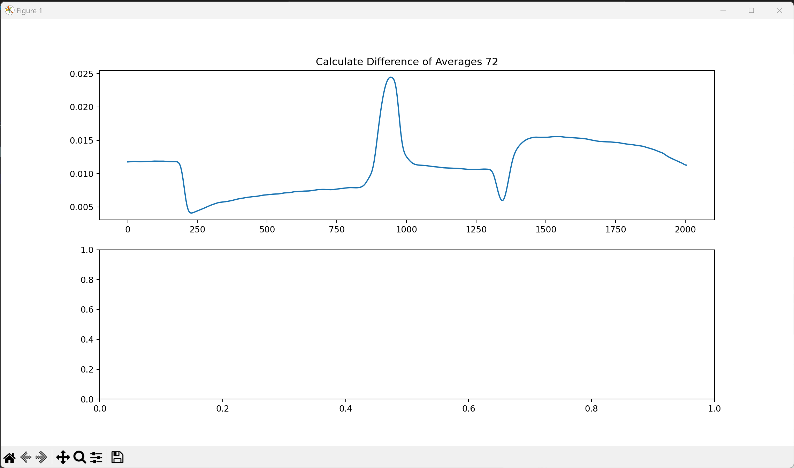
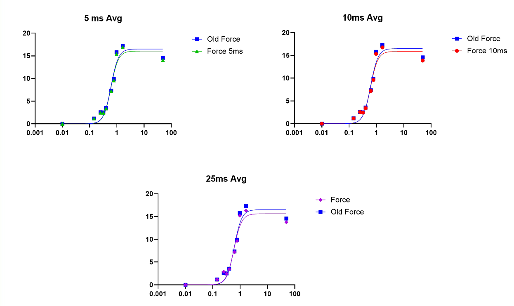
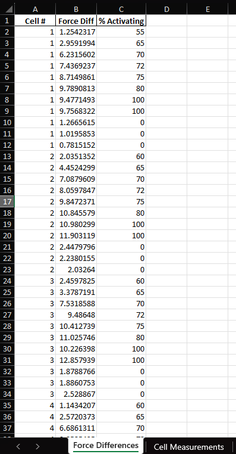
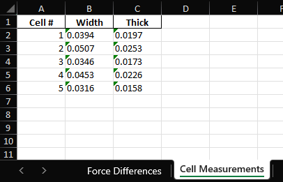
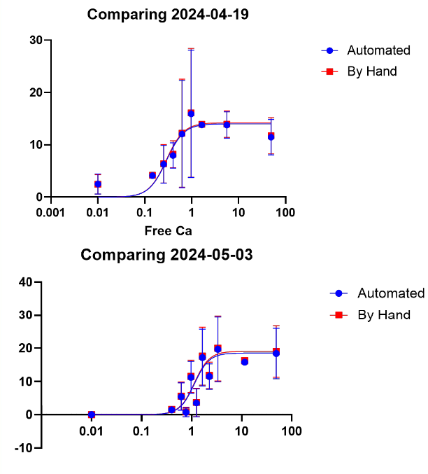

# Single Cell Mechanics Analysis
 <a href = " https://www.python.org/downloads/release/python-3110/ " ></a> 
 <a href = "https://github.com/maxwellbowser/SCM_analysis/blob/main/LICENSE" > </a>  <a href="https://github.com/psf/black"> </a>

## Summary:
Software for analyzing .DAT files from Single Cell Mechanics (SCM)

I'm creating this repository as a User Guide for future people in the Gregorio Lab, or for anyone who is doing SCM and may find this useful.

## Setup Specifications
* Aurora ASI600A (Software version)
* Linux KDE Shell, Ubuntu Kernel

## User Guide
There are 2 scripts in this repo, an automated version of the SCM analysis (pCa_SCM_analysis.py), and a more manual version (pCa_SCM_analysis_manual.py).

## Manual Version:
In the manual version, you select all of the force recording files done for a single cell (should be .dat files), then are shown the force traces one by one. 

When the first file is opened, you are shown the cell dimensions (Figure 1), provided you write them in the Aurora Setup Comment tab as:  
**Mouse C843 Cell 1**  
**Width 0.0316**  
**Thick 0.0158**

The above numbers don't need to match, only the layout of the text, where it **begins with a line of text (Mouse ID, etc.) and "Width" & "Thick" following it.**

<div>

</div>

*Figure 1: Example of cell size pop up.*


After entering these values into the analysis sheet ("pCa SCM Analysis.xlsx"), hit "OK" on this pop up and you will see the first force trace (Figure 2).

  
*Figure 2: Trace of filtered cell force.*

To calculate the difference between 2 areas, **you simply click and drag on the graph to select one area, then the next**. These points in these two areas are then averaged and their absolute difference is displayed in the bottom panel (Figure 3).


  
*Figure 3: Gif of selecting cell force trace.*


**You can then write/copy down the force difference onto the provided Excel sheet ("pCa SCM Analysis.xlsx")**.  

The "72" shown in this example is simply the name of the file. So, for example, if your files are named "pCa point 6.75.dat", the text would read "pCa point 6.75 Difference: 5.000µN". <ins>Please note that there is a required naming convention for the automated analysis.</ins>


To continue onto the next selected file, you close the window, at which point the next file is opened (Figure 4).

  
*Figure 4: Gif of closing cell force trace, to cycle to next file.*  

After all files are displayed, the program closes and opens a folder containing Comma Separated Value (CSV) files of the filtered forces.

## Automated Version:

The automated version of this analysis is **much** faster, however it only will work correctly if the files are properly formatted. This is why I reccomend doing the by-hand analysis first, to have data to compare against.

The automated version does the same basic calculation as the manual one. The order of operations for each file is:
1. **Averages the first 200 ms** (variable "FIRST_AVG" in .py file)   
2. **Waits 40 ms** (variable "PAUSE" in .py file)
3. **Averages the next 5 ms** (variable "SECOND_AVG" in .py file)
4. **Calculates the difference between them**

This difference is saved, along with the cell widths. I've chosen the times based on tests I ran, comparing the manual calculations to the automated version (Figure 5). The pause time of 40ms is optimized for a filtering strength of 10. This all may be changed in the top of the code, but **I highly reccomend to run tests on any timing changes**.


*Figure 5: Graphs of analysis data, testing different times for step 3 of analysis (see above). Hand measurements (or "Old Force") in blue show the desired values. I tested 5ms, 10ms, and 25ms and saw that 5ms gave the best results, mainly in the highest Ca values. This is because high Ca cells quickly recover force, therefore a shorter average time does not include the "rebound" in force.*

**IMPORTANT:** Rather than selecting all of the raw files, with the automated version, you select one folder containing all of the cell recordings.
--

### Folder Layout for Analysis:
```bash
|-- Folder_to_Select
    |-- Cell 1
    |   |-- Passive.dat
    |   |-- 80.dat
    |   |-- ...
    |   |-- Active.dat
    |
    |-- Cell 2
    |   |-- Passive.dat
    |   |-- 80.dat
    |   |-- ...
    |   |-- Active.dat
    |
    |-- Cell 3
    |   |-- Passive.dat
    |   |-- 80.dat
    |   |-- ...
    |   |-- Active.dat  
    |
    |-- ...
    |-- Cell n
    |   |-- Passive.dat
    |   |-- 80.dat
    |   |-- ...
    |   |-- Active.dat

```

After selecting and running, the output file contains 2 sheets. The first sheet (Figure 6) has columns for the Cell #, the % of activating solution (derived from the file name), and the forces. 

<div>
 
</div>

*Figure 6: Automated SCM analysis output Sheet 1, calculated forces and Ca++ concentration.* 

The second sheet (Figure 7) has the cell dimensions, provided that they are entered according the Aurora Comments convention mentioned in [the Manual Version](#manual-version).

<div>
 
</div>

*Figure 7: Automated SCM analysis output Sheet 2, cell dimensions.*

### Naming Convention
Our file naming convention is that the file names contain the % of activating solution in the mixture, with 100% and 0% being named differently, as "Passive" or "Active". If a file is processed that does not follow this convention, a warning is thrown and the program asks for input of what % of activating solution to use.

From the % of activating, the pCa chart in the Excel file has all of the % single-digit mixtures possible, and the free Ca++ associated (calculated using [this calculator](https://somapp.ucdmc.ucdavis.edu/pharmacology/bers/maxchelator/CaMgATPEGTA-TS.htm) hosted by UCDavis). 

The concentrations for these buffers are shown below (Table 1). The calculation of [Ca] in buffers with chelators is pretty tricky, so please use caution when creating new buffer recipes. All of these buffers and solutions were calculated by Gerrie Farman, my mentor, who has many many years of experience.

Buffer Concentrations (pH to 7.00)
-------------------		
Reagent | Relax (mM) |	Activating (mM)
--------|------------|-------
ATP	|6.3100	|6.2700
MgCl2|	5.7000| 5.7400
EGTA	|2.0000|	2.0000
Calcium	|0.0000	|2.1815
Kprop	|156	|156
BES	|10|	10
DTT|	1	|1

## Results & Analysis

After developing the automated version of this analyis, I checked the accuracy of my analysis by also doing analysis manually. The results are plotted below (Figure 9). I felt comfortable enough with these results to move forward only using automated analysis, as I also found I had a 1-2% margin when doing manual analysis. 

  
*Figure 9: Graphs of 2 days of SCM data, with 6-8 cells per Ca point, analyzed manually (red) as well as automated (blue).*

To do the final analysis, if using the automated version, copy & paste cell forces into the provided excel sheet along with the cell sizes.

